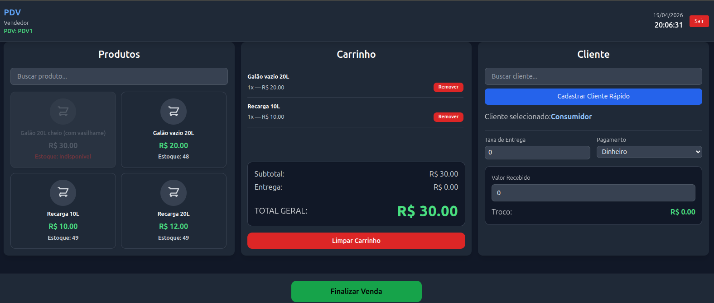
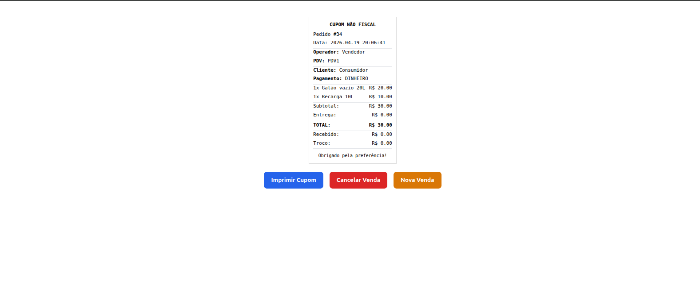
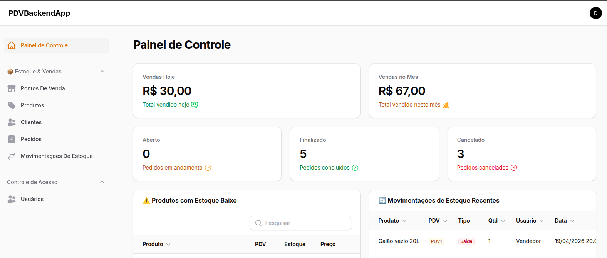

# 🛒 PDV System — Sistema Completo de Ponto de Venda

O **PDV System** é uma solução completa de ponto de venda (POS), composta por um frontend em Vue.js para operação de caixa e um backend em Laravel com API REST e painel administrativo.

O sistema foi projetado para gerenciar vendas, estoque, clientes e operações comerciais em tempo real.

---

## 🎯 Objetivo

Fornecer uma solução robusta para:

* operação de vendas em ponto de venda
* controle de estoque por unidade (PDV)
* gestão de clientes e pedidos
* controle financeiro básico (pagamentos e troco)

---

## ⚙️ Principais funcionalidades

### 🛒 Operação de vendas (Frontend PDV)

* login de operador
* seleção de ponto de venda
* listagem e busca de produtos
* carrinho de compras dinâmico
* cálculo automático de total e troco
* finalização de venda
* impressão de cupom

---

### 👤 Gestão de clientes

* busca rápida de clientes
* cadastro direto no PDV
* cliente padrão ("Consumidor")
* suporte a entrega com endereço

---

### 📦 Controle de estoque

* estoque por PDV (multi-loja)
* baixa automática ao vender
* estorno automático ao cancelar venda
* movimentações de entrada e saída

---

### 📊 Backend administrativo (Filament)

* gestão de PDVs
* cadastro de produtos
* controle de clientes
* gerenciamento de pedidos
* controle de usuários (admin, owner, seller)
* movimentações de estoque

---

### 📈 Dashboard de gestão

* vendas do dia/mês
* status de pedidos
* produtos com baixo estoque
* histórico de movimentações

---

## 🧠 Diferenciais técnicos

* ⚡ **Frontend desacoplado (Vue 3 + Pinia)**
* 🔐 **API REST com autenticação Sanctum**
* 🏬 **Arquitetura multi-PDV (multi-loja)**
* 📦 **Controle de estoque por pivot (pdv_product)**
* 🔄 **Reversão automática de estoque**
* 🔊 **Feedback visual e sonoro na operação**
* 📊 **Dashboard administrativo com métricas reais**

---

## 🏗️ Arquitetura

### Frontend

* Vue 3
* Pinia (estado global)
* Vue Router
* Tailwind CSS
* Axios

### Backend

* Laravel 12
* FilamentPHP 4
* MySQL
* Sanctum (API Auth)

📄 Detalhes técnicos: [Arquitetura do sistema](./docs/arquitetura.md)

---

## 🔄 Fluxo do sistema

1. Operador realiza login
2. Seleciona o PDV ativo
3. Sistema carrega produtos disponíveis
4. Operador monta carrinho
5. Seleciona cliente e forma de pagamento
6. Finaliza venda
7. Sistema baixa estoque automaticamente
8. Cupom é exibido/imprimido
9. Venda pode ser cancelada (com estorno de estoque)

---

## 📸 Demonstração

<h3 align="center">Tela de Venda</h3>

  

<h3 align="center">Cupom Fiscal</h3>

  

<h3 align="center">Painel Administrativo</h3>

  

---

## 🔗 Acesso

👉 https://pdv.jeancarlos.com.br

---

## 🚧 Status

Projeto funcional com foco em operação real de vendas.

---

## 👨‍💻 Autor

Jean Carlos Charão Sabino
🔗 https://jeancarlos.com.br
🔗 https://www.linkedin.com/in/jeancarloscharaosabino/
